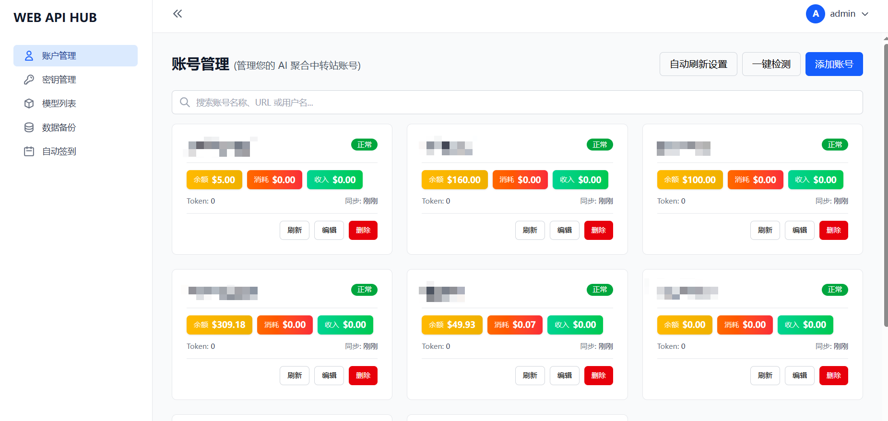
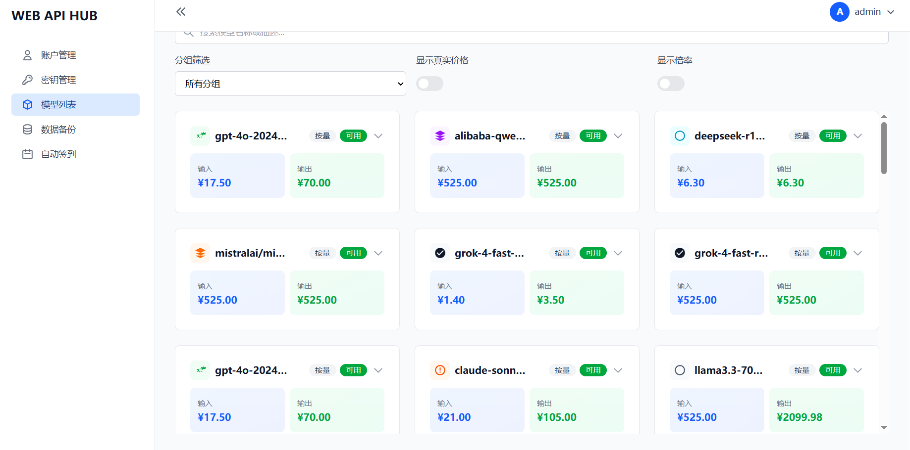
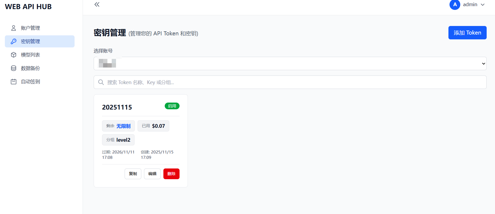

# WEB API HUB

一个基于 Web 的 AI 聚合中转站管理平台，支持多账号管理、密钥管理、模型列表查看、自动签到、数据备份等功能。

## 功能特性

- 账号管理：支持多个 AI 聚合中转站账号的统一管理
- 密钥管理：管理 API Token 和密钥
- 模型列表：查看可用模型及价格信息
- 自动签到：支持自动签到功能（待实现）
- 自动刷新：定时刷新账号余额等信息
- 数据备份：支持数据导入导出

   

   

   

## 技术栈

- 前端：React + TypeScript + Vite + Tailwind CSS
- 后端：Node.js + Express + TypeScript + Prisma
- 数据库：SQLite
- 部署：Docker + Docker Compose

## Docker 部署

### 前置要求

- Docker
- Docker Compose

### 部署步骤

1. 克隆项目到本地

```bash
git clone <repository-url>
cd web-app
```

2. 配置环境变量

复制环境变量示例文件并修改配置：

```bash
cp env.example .env
```

编辑 `.env` 文件，配置以下必要参数：

- `JWT_SECRET`: JWT 密钥（用于用户认证）
- `DEFAULT_USERNAME`: 默认管理员用户名
- `DEFAULT_PASSWORD`: 默认管理员密码
- `FRONTEND_URL`: 前端访问地址
- `BACKEND_PORT`: 后端服务端口（默认 3000）
- `FRONTEND_PORT`: 前端服务端口（默认 5173）

3. 构建并启动服务

```bash
docker-compose build
docker-compose up -d
```

4. 查看服务状态

```bash
docker-compose ps
```

5. 查看日志

```bash
# 查看所有服务日志
docker-compose logs -f

# 查看后端日志
docker-compose logs -f backend

# 查看前端日志
docker-compose logs -f frontend
```

### 常用命令

```bash
# 停止服务
docker-compose down

# 重启服务
docker-compose restart

# 重启后端服务
docker-compose restart backend

# 重启前端服务
docker-compose restart frontend

# 进入后端容器
docker-compose exec backend sh

# 进入前端容器
docker-compose exec frontend sh

# 清理所有容器和卷
docker-compose down -v
```

### 数据存储

项目数据存储在 `./data` 目录下（与 docker-compose.yml 同级），包括：

- `database.db`: SQLite 数据库文件

### 访问应用

启动成功后，访问以下地址：

- 前端：http://localhost:5173（或配置的 FRONTEND_PORT）
- 后端 API：http://localhost:3000/api（或配置的 BACKEND_PORT）

### 默认账户

首次登录使用环境变量中配置的默认账户：

- 用户名：`.env` 文件中的 `DEFAULT_USERNAME`
- 密码：`.env` 文件中的 `DEFAULT_PASSWORD`

## 开发

### 本地开发

前端开发：

```bash
cd frontend
npm install
npm run dev
```

后端开发：

```bash
cd backend
npm install
npm run dev
```

### 数据库迁移

```bash
# 进入后端容器
docker-compose exec backend sh

# 运行迁移
npm run prisma:migrate

# 或打开 Prisma Studio
npm run prisma:studio
```

## 许可证

MIT License

